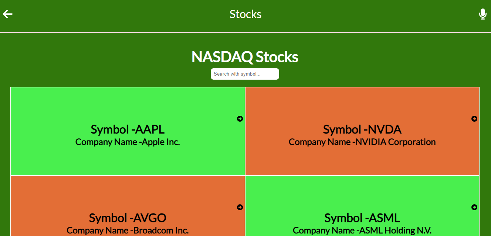

<a name="readme-top"></a>

<div align="center">

  <h3><b>React Stocks Project</b></h3>
  

</div>

<!-- TABLE OF CONTENTS -->

# 📗 Table of Contents

- [📖 About the Project](#about-project)
  - [🛠 Built With](#built-with)
    - [Tech Stack](#tech-stack)
    - [Key Features](#key-features)
  - [🚀 Live Demo](#live-demo)
- [💻 Getting Started](#getting-started)
  - [Setup](#setup)
  - [Prerequisites](#prerequisites)
  - [Install](#install)
  - [Usage](#usage)
  - [Run tests](#run-tests)
  - [Deployment](#triangular_flag_on_post-deployment)
- [👥 Authors](#authors)
- [🔭 Future Features](#future-features)
- [🤝 Contributing](#contributing)
- [⭐️ Show your support](#support)
- [🙏 Acknowledgements](#acknowledgements)
- [❓ FAQ (OPTIONAL)](#faq)
- [📝 License](#license)

<!-- PROJECT DESCRIPTION -->

# 📖 [React-Stocks-Project] <a name="about-project"></a>

**[React-Stocks-Project]** In this project Stocks are fetched using API and their details are also fetched using API and details of the specific stock are shown when user click on that stock. User can also filter stocks using search Bar.

- [Video Link about Project] <a href="https://www.loom.com/share/ad61ac8427ca4c649013a752258bfc61"><button type="button" color:red background: white>Click Here</button></a>

## 🛠 Built With <a name="HTML, CSS, Javascript and React-Redux"></a>
- HTML
- CSS
- Javascript
- React-Redux

### Tech Stack <a name="tech-stack"></a>

<details>
  <summary>Client</summary>
  <ul>
    <li><a href="https://html.com/#What_is_HTML">"HTML"</a></li>
    <li><a href="https://html.com/css/#What_is_CSS">"CSS"</a></li>
    <li><a href="https://www.javascript.com/">"Javascript"</a></li>
    <li><a href="https://fr.legacy.reactjs.org/">"React"</a></li>
  </ul>
</details>

<!-- Features -->

### Key Features <a name="key-features"></a>

- [x] Create a stocks web app
- [x] Show all stocks data using API
- [x] Show details of specific stock on click using API
- [x] User can filter specific stock using searchbar

<p align="right">(<a href="#readme-top">back to top</a>)</p>

<!-- LIVE DEMO -->

## 🚀 Live Demo <a name="live-demo"></a>

- [Coming Soon]()

<p align="right">(<a href="#readme-top">back to top</a>)</p>

<!-- GETTING STARTED -->

## 💻 Getting Started <a name="getting-started"></a>

To get a local copy up and running, follow these steps.

### Prerequisites

In order to run this project you need:
Open terminal on the same folder of the project and run:

```sh
 npm install
```

### Setup

Clone this repository to your desired folder:

```sh
  git https://github.com/zunairkhan811/react-stocks-project.git
  cd react-book-store
```

### Install

Install this project with:

```sh
  npm install
```

### Usage

```
1. download the project from clone
2. Install all dependencies using *npm install* in your visual studio terminal
3. Run *npm run start*
4. You can see it in the browser
```

### Build for production

```
npm run build
```

### Run tests

- ### Linter Tests

To run tests, run the following command:

To check for html errors run:

```sh
  npx hint .
```

To check for css errors run:

```sh
  npx stylelint "**/*.{css,scss}"
```

To check for js errors run:

```sh
  npx eslint "**/*.{js,jsx}"
```

<p align="right">(<a href="#readme-top">back to top</a>)</p>

<!-- AUTHORS -->

## 👥 Authors <a name="authors"></a>

👤 **Muhammad Zunair khan**

- GitHub: [@zunairkhan811](https://github.com/zunairkhan811)
- Twitter: [@zunairkhan811](https://twitter.com/zunairkhan811)
- LinkedIn: [zunairkhan811](https://linkedin.com/in/zunairkhan811)

<p align="right">(<a href="#readme-top">back to top</a>)</p>

<!-- FUTURE FEATURES -->

## 🔭 Future Features <a name="future-features"></a>

- [x] Add Responsiveness to website
- [x] Add some new features to the project

<p align="right">(<a href="#readme-top">back to top</a>)</p>

<!-- CONTRIBUTING -->

## 🤝 Contributing <a name="contributing"></a>

Contributions, issues, and feature requests are welcome!

Feel free to check the [https://github.com/zunairkhan811/react-stocks-project.git](issue page).

<p align="right">(<a href="#readme-top">back to top</a>)</p>

<!-- SUPPORT -->

## ⭐️ Show your support <a name="support"></a>

If you like this feel free to follow me on github and give this project a star..

<p align="right">(<a href="#readme-top">back to top</a>)</p>

<!-- ACKNOWLEDGEMENTS -->

## 🙏 Acknowledgments <a name="acknowledgements"></a>

- Thanks to the Microverse team for the great curriculum.
- Thanks to the Code Reviewer(s) for the insightful feedbacks.

<p align="right">(<a href="#readme-top">back to top</a>)</p>

<!-- FAQ (optional) -->

<!-- ## ❓ FAQ (OPTIONAL) <a name="faq"></a>

- **[How_to_start]**

  - [Register_for_a_full_stack_program_like_Microverse]

- **[How_to_contact_you]**

  - [Follow_me_on_Github]
 -->
<p align="right">(<a href="#readme-top">back to top</a>)</p>

<!-- LICENSE -->

## 📝 License <a name="license"></a>

This project is [MIT](./LICENSE) licensed.

<p align="right">(<a href="#readme-top">back to top</a>)</p>